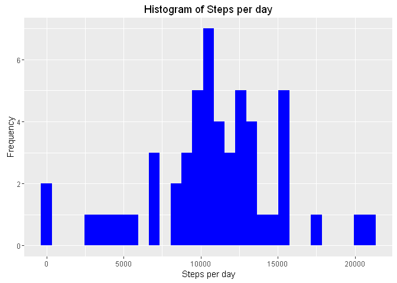
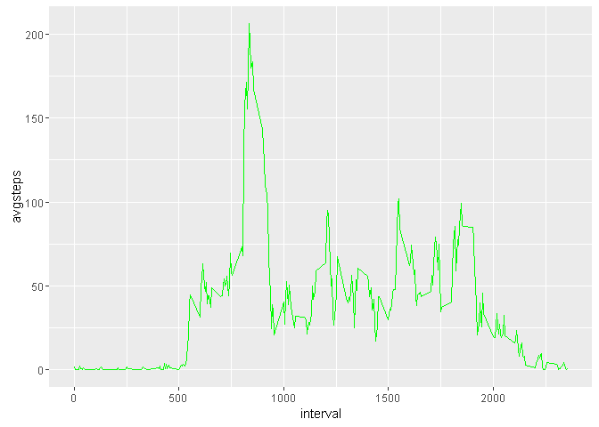
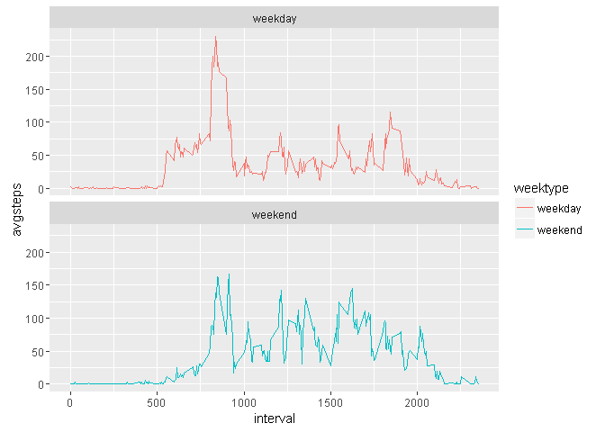

# Reproducible Research Course Project 1
Best learning  
April 24, 2016  


## Introduction of project 1


This assignment makes use of data from a personal activity monitoring device. This device collects data at 5 minute intervals through out the day. The data consists of two months of data from an anonymous individual collected during the months of October and November, 2012 and include the number of steps taken in 5 minute intervals each day.

The data for this assignment can be downloaded from the course web site:

Dataset: [Activity monitoring data](https://d396qusza40orc.cloudfront.net/repdata%2Fdata%2Factivity.zip)

The variables included in this dataset are:

steps: Number of steps taking in a 5-minute interval (missing values are coded as NA)
date: The date on which the measurement was taken in YYYY-MM-DD format
interval: Identifier for the 5-minute interval in which measurement was taken
The dataset is stored in a comma-separated-value (CSV) file and there are a total of 17,568 observations in this dataset.

##Loading and preprocessing the data


```r
mydirectory<-"C:/Users/uchae/Documents/R/course/reproducible research"
setwd(mydirectory)


fileurl<-"https://d396qusza40orc.cloudfront.net/repdata%2Fdata%2Factivity.zip"
   
    download.file(fileurl,destfile="./data/activity")
    list.files("./data")
```

```
## [1] "activity"     "activity.csv"
```

```r
    DateDownLoaded<-date()
    myfile <-unzip("./data/activity",exdir ="./data")
    activity<-read.csv(myfile,sep=",",head=TRUE,colClasses = c("numeric", "character",                                                                         "integer"))
    summary(activity)
```

```
##      steps            date              interval     
##  Min.   :  0.00   Length:17568       Min.   :   0.0  
##  1st Qu.:  0.00   Class :character   1st Qu.: 588.8  
##  Median :  0.00   Mode  :character   Median :1177.5  
##  Mean   : 37.38                      Mean   :1177.5  
##  3rd Qu.: 12.00                      3rd Qu.:1766.2  
##  Max.   :806.00                      Max.   :2355.0  
##  NA's   :2304
```

```r
    head(activity)
```

```
##   steps       date interval
## 1    NA 2012-10-01        0
## 2    NA 2012-10-01        5
## 3    NA 2012-10-01       10
## 4    NA 2012-10-01       15
## 5    NA 2012-10-01       20
## 6    NA 2012-10-01       25
```

    # unzip all of the files in the downloaded .zip file into the current working directory
    # then save all of their unzipped locations into a character vector called 'myfile'
    
    
    Load in the necessary packages


```r
library(dplyr)
```

```
## 
## Attaching package: 'dplyr'
```

```
## The following objects are masked from 'package:stats':
## 
##     filter, lag
```

```
## The following objects are masked from 'package:base':
## 
##     intersect, setdiff, setequal, union
```

```r
library(lubridate)
```

```
## Warning: package 'lubridate' was built under R version 3.2.5
```

```
## 
## Attaching package: 'lubridate'
```

```
## The following object is masked from 'package:base':
## 
##     date
```

```r
library(ggplot2)
```
   
   
Change the date into dateformat using lubridate:


```r
activity$date <- ymd(activity$date)

   str(activity)
```

```
## 'data.frame':	17568 obs. of  3 variables:
##  $ steps   : num  NA NA NA NA NA NA NA NA NA NA ...
##  $ date    : Date, format: "2012-10-01" "2012-10-01" ...
##  $ interval: int  0 5 10 15 20 25 30 35 40 45 ...
```
   
## What is mean total number of steps taken per day?

For this part of the assignment, you can ignore the missing values in the dataset.

### 1. Calculate the total number of steps per day.  
Use dplyr and group by date

```r
 totalstepsperday<- activity %>%
  filter(!is.na(steps)) %>%
  group_by(date) %>%
  summarize(dailysteps = sum(steps)) %>%
  print
```

```
## Source: local data frame [53 x 2]
## 
##          date dailysteps
##        (date)      (dbl)
## 1  2012-10-02        126
## 2  2012-10-03      11352
## 3  2012-10-04      12116
## 4  2012-10-05      13294
## 5  2012-10-06      15420
## 6  2012-10-07      11015
## 7  2012-10-09      12811
## 8  2012-10-10       9900
## 9  2012-10-11      10304
## 10 2012-10-12      17382
## ..        ...        ...
```

### 2.Make a histogram of the total number of steps taken each day. 
Here we can use ggplot.

```r
ggplot(totalstepsperday, aes(x =dailysteps)) +
  geom_histogram(fill = "blue", binwidth =700) +
  labs(title = "Histogram of Steps per day", x = "Steps per day", y = "Frequency")
```


   
### 3.Calculate and report the mean and median of the total number of steps taken per day  
 

```r
mean_stepsperday <- mean(totalstepsperday$dailysteps,na.rm = TRUE)
median_stepsperday <- median(totalstepsperday$dailysteps,na.rm = TRUE)
 mean_stepsperday
```

```
## [1] 10766.19
```

```r
median_stepsperday
```

```
## [1] 10765
```
Average steps taken per day are `mean_stepsperday` and `median_stepsperday` median steps per day are 10765.
   
## What is the average daily activity pattern? 

### 1. Make a time series plot (i.e. type = "l") of the 5-minute interval (x-axis) and the average number of steps taken, averaged across all days (y-axis)

```r
interval <- activity %>%
  filter(!is.na(steps)) %>%
  group_by(interval) %>%
  summarize(avgsteps = mean(steps))

ggplot(interval, aes(x=interval, y=avgsteps)) +
  geom_line(color = "green")
```




###Which 5-minute interval, on average across all the days in the dataset, contains the maximum number of steps?


```r
maxnumsteps<-interval[which.max(interval$avgsteps),]
maxnumsteps[1,1]
```

```
## Source: local data frame [1 x 1]
## 
##   interval
##      (int)
## 1      835
```
The interval `maxnumsteps[1]` has, on average, the highest count of steps, with `maxnumsteps[2]` steps.
   
   
## Imputing missing values

Note that there are a number of days/intervals where there are missing values (coded as NA). The presence of missing days may introduce bias into some calculations or summaries of the data.

Calculate and report the total number of missing values in the dataset (i.e. the total number of rows with activity_new)
Devise a strategy for filling in all of the missing values in the dataset. The strategy does not need to be sophisticated. For example, you could use the mean/median for that day, or the mean for that 5-minute interval, etc. Create a new dataset that is equal to the original dataset but with the missing data filled in.
Make a histogram of the total number of steps taken each day and Calculate and report the mean and median total number of steps taken per day. Do these values differ from the estimates from the first part of the assignment? What is the impact of imputing missing data on the estimates of the total daily number of steps?

 
### Calculating total number of missing values  

```r
   missing<-sum(is.na(activity$steps))
```
 
 Missing values are `missing`.
 
 
### Filling in all of the missing values in the dataset  
 
Create a new dataset as the original and use tapply for filling in the missing values with the average number of steps per 5-minute interval:


```r
activity_newset<-activity
activity_na <- is.na(activity$steps)
avg_interval <- tapply(activity$steps, activity$interval, mean, na.rm=TRUE, simplify=TRUE)
activity_newset$steps[activity_na] <- avg_interval[as.character(activity$interval[activity_na])] 
```
   

```r
   sum(is.na(activity_newset$steps))
```

```
## [1] 0
```
 
 No missing value is found.  
   
###Calculate the number of steps taken in each 5-minute interval per day using dplyr and group by interval. Use ggplot for making the histogram:
   

```r
stepsperday_newset <- activity_newset %>%
  filter(!is.na(steps)) %>%
  group_by(date) %>%
  summarize(dailysteps_newset = sum(steps)) %>%
  print
```

```
## Source: local data frame [61 x 2]
## 
##          date dailysteps_newset
##        (date)             (dbl)
## 1  2012-10-01          10766.19
## 2  2012-10-02            126.00
## 3  2012-10-03          11352.00
## 4  2012-10-04          12116.00
## 5  2012-10-05          13294.00
## 6  2012-10-06          15420.00
## 7  2012-10-07          11015.00
## 8  2012-10-08          10766.19
## 9  2012-10-09          12811.00
## 10 2012-10-10           9900.00
## ..        ...               ...
```
   

```r
   ggplot(stepsperday_newset, aes(x =dailysteps_newset )) +
  geom_histogram(fill = "red", binwidth = 1000) +
  labs(title = "Histogram of Steps per day, including missing values", x = "Steps per day", y = "Frequency")
```


###Calculate and report the mean and median total number of steps taken per day from new dataset with missing values filled with mean steps for the each interval.


```r
mean_stepsperday_newset <- mean(stepsperday_newset$dailysteps_newset,na.rm = TRUE)
median_stepsperday_newset <- median(stepsperday_newset$dailysteps_newset,na.rm = TRUE)
 mean_stepsperday_newset
```

```
## [1] 10766.19
```

```r
median_stepsperday_newset
```

```
## [1] 10766.19
```

When imputing missing data with the average number of steps in the same 5-min interval, both the mean and the median have the same value,`mean_stepsperday_newset`.

## Are there differences in activity patterns between weekdays and weekends?

For this part the weekdays() function may be of some help here. Use the dataset with the filled-in missing values for this part.

Create a new factor variable in the dataset with two levels - "weekday" and "weekend" indicating whether a given date is a weekday or weekend day.
Make a panel plot containing a time series plot (i.e. type = "l") of the 5-minute interval (x-axis) and the average number of steps taken, averaged across all weekday days or weekend days (y-axis). See the README file in the GitHub repository to see an example of what this plot should look like using simulated data.


Use dplyr and mutate to create a new column, weektype, and apply whether the day is weekend or weekday:


```r
activity_newset <- mutate(activity_newset,weektype = ifelse(weekdays(activity_newset$date) == "Saturday"|weekdays(activity_newset$date) == "Sunday", "weekend", "weekday"))
activity_newset$weektype <- as.factor(activity_newset$weektype)
head(activity_newset)
```

```
##       steps       date interval weektype
## 1 1.7169811 2012-10-01        0  weekday
## 2 0.3396226 2012-10-01        5  weekday
## 3 0.1320755 2012-10-01       10  weekday
## 4 0.1509434 2012-10-01       15  weekday
## 5 0.0754717 2012-10-01       20  weekday
## 6 2.0943396 2012-10-01       25  weekday
```

Make a panel plot containing the time series of the 5-minute interval for weekday and weekend, and compare the average steps.
   

```r
interval_newset <-activity_newset %>%
  group_by(interval, weektype) %>%
  summarise(avgsteps = mean(steps))
g <- ggplot(interval_newset, aes(x=interval, y=avgsteps, color = weektype)) +
  geom_line() +
  facet_wrap(~weektype, ncol = 1, nrow=2)
print(g)
```


   
During weekdays, this individual is very active in ealier time of the day compared to weekends.But she or he seems to more active overall in the weekends  compared with weekdays. 
